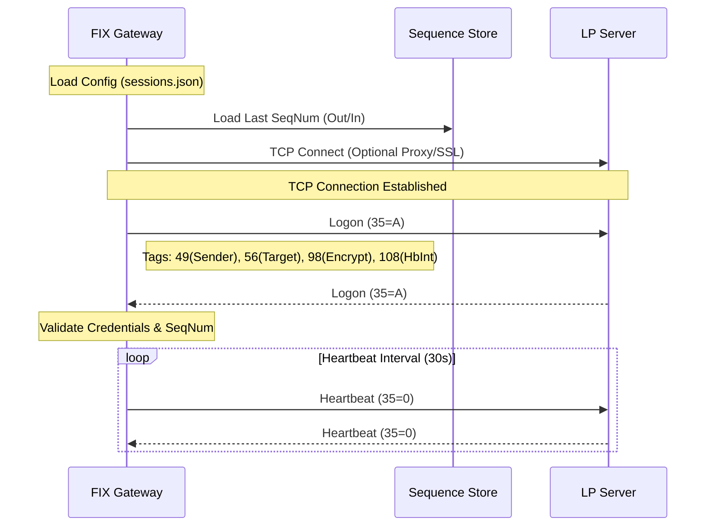
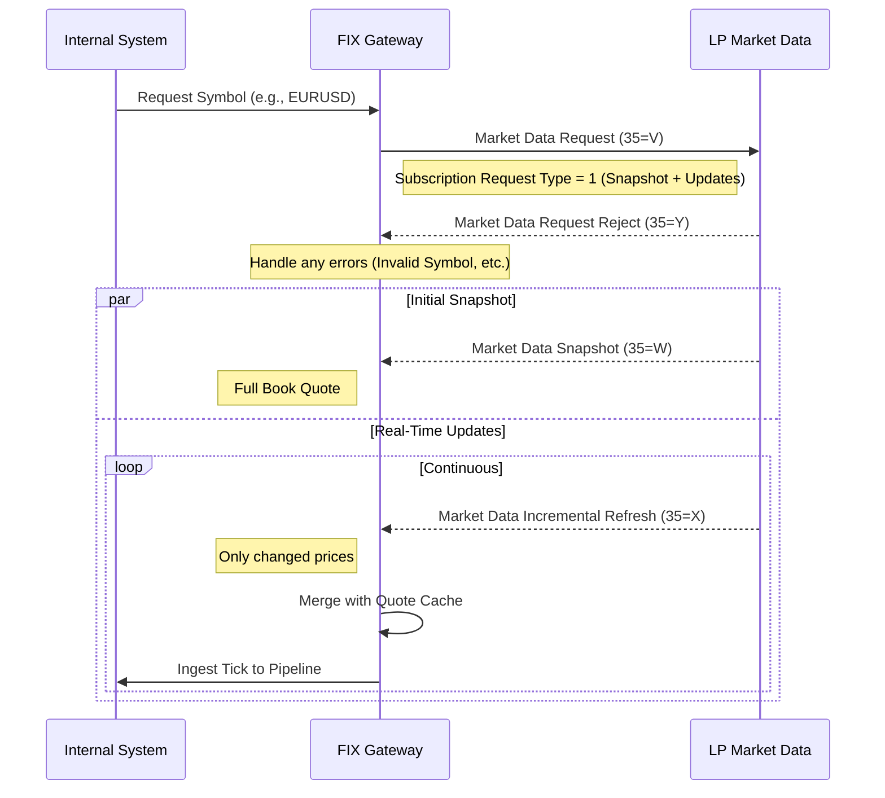

# FIX Protocol 4.4 Implementation Reference

This document provides a technical reference for the FIX 4.4 implementation used in the Trading Engine, specifically focusing on the connection architecture and real-time market data fetching mechanism.

## 1. System Architecture

The FIX Gateway acts as a bridge between the internal trading/data systems and external Liquidity Providers (LPs).

```mermaid
graph TD
    subgraph "Internal System"
        A[Trading Engine Core]
        B[Market Data Pipeline]
        C[Admin Dashboard]
    end

    subgraph "FIX Gateway"
        D[Gateway Service]
        E[Session Manager]
        F[Message Parser]
        G[Sequence Store (File-based)]
    end

    subgraph "External LP (YoFx)"
        H[FIX Server (Trading)]
        I[FIX Server (Quotes)]
    end

    A -->|Orders| D
    D -->|Exec Reports| A
    
    D -->|Ticks| B
    B -->|Real-time Feed| C
    
    D <-->|Session YOFX1 (Trading)| H
    D <-->|Session YOFX2 (Market Data)| I
    
    D --- E
    E --- G
    D --- F
```

## 2. Connection Implementation

The connection logic is handled by the `FIXGateway` struct in `gateway.go`. It supports dual-session architecture: one for executing trades and one specifically for high-throughput market data.

### 2.1 Connection Flow



### 2.2 Key Code Components

#### Session Configuration
Connections are defined in `config/sessions.json`.
*   **YOFX1**: Trading Session (Order routing).
*   **YOFX2**: Market Data Session (Price feeds).

#### TCP & Proxy Handling
The gateway supports direct TCP, SSL/TLS, and SOCKS5/HTTP Proxies to bypass firewalls.
*   **File**: `backend/fix/gateway.go`
*   **Function**: `connectSession` and `dialViaHTTPProxy`
*   **Mechanism**: Uses `net.DialTimeout` or established proxy tunnels. Optimizes TCP with `SetNoDelay(true)` and large read buffers (128KB) for market data.

#### Sequence Number Management
Critical for FIX reliability.
*   **Storage**: Local files in `./fixstore/<SessionID>.seqnums`.
*   **Resync**: Automatically handles `ResendRequest` (35=2) and `SequenceReset` (35=4) to recover missed messages.

## 3. Market Data Fetching (Real-Time)

Real-time codes and prices are fetched via the **YOFX2** session using a subscription model.

### 3.1 Fetching Flow



### 3.2 Implementation Details

#### 1. Subscribing to Data (Sending 35=V)
To fetch data, the gateway sends a **Market Data Request (V)**.
*   **Tag 263**: `1` (Snapshot + Subscribe).
*   **Tag 264**: `1` (Market Depth - Top of Book).
*   **Tag 267**: `2` (Entry Types: Bid=0, Ask=1).
*   **Tag 146**: No. of Symbols (Repeated group for batch subscriptions).

#### 2. Processing Snapshots (Receiving 35=W)
Full price state sent initially.
*   **Handler**: `handleMarketDataSnapshot`
*   **Logic**: Parses the MDEntry group (Tags 268-278).
    *   Extracts Bid (`EntryType=0`) and Ask (`EntryType=1`).
    *   Updates internal `quoteCache`.
    *   Publishes to `MarketDataPipeline`.

#### 3. Processing Updates (Receiving 35=X)
Incremental changes for high efficiency.
*   **Handler**: `handleMarketDataIncremental`
*   **Logic**:
    1.  Retrieves last known state from `quoteCache`.
    2.  Applies the delta change (Update Action: New/Change/Delete).
    3.  Pushes new price to the system.

### 3.3 Data Parsing Reference

Values are parsed using a zero-allocation `Parser` (`backend/fix/internal/message/parser.go`).

**Standard Market Data Tags Used:**
*   **55**: Symbol (e.g., "EURUSD")
*   **269**: MDEntryType (0=Bid, 1=Ask)
*   **270**: MDEntryPx (Price)
*   **271**: MDEntrySize (Volume)

## 4. Integration with Trading Engine

The fetched data is normalized and ingested into the core pipeline via `backend/datapipeline/integration.go`.

*   **Adapter**: `IntegrationAdapter` converts FIX `MarketData` struct -> `RawTick`.
*   **Ingestion**: `pipeline.IngestTick(rawTick)` broadcasts to WebSockets/Frontend.

---

