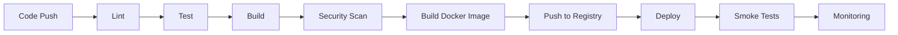

# RTX Trading Engine - Deployment Guide

## Table of Contents

1. [Overview](#overview)
2. [Prerequisites](#prerequisites)
3. [Architecture](#architecture)
4. [Environment Setup](#environment-setup)
5. [CI/CD Pipeline](#cicd-pipeline)
6. [Deployment Strategies](#deployment-strategies)
7. [Database Migrations](#database-migrations)
8. [Monitoring and Logging](#monitoring-and-logging)
9. [Troubleshooting](#troubleshooting)
10. [Rollback Procedures](#rollback-procedures)

## Overview

This guide covers the deployment process for the RTX Trading Engine backend application across development, staging, and production environments using Kubernetes and GitHub Actions.

### Key Features

- **Multi-environment deployment** (dev, staging, production)
- **Blue-Green deployment** for zero-downtime production releases
- **Automated CI/CD** pipelines with GitHub Actions
- **Horizontal Pod Autoscaling** for dynamic load handling
- **Database migration** management
- **Comprehensive monitoring** with Prometheus and Grafana
- **Security scanning** integrated into CI/CD

## Prerequisites

### Required Tools

- **kubectl** (v1.28+)
- **Docker** (v24+)
- **Helm** (v3+) (optional, for chart management)
- **Git** (v2.40+)

### Access Requirements

- GitHub repository access with Actions enabled
- Kubernetes cluster access (kubeconfig)
- Container registry credentials (GitHub Container Registry)
- AWS credentials (for S3 backups and ELB)

### Environment Variables

Create the following secrets in your GitHub repository:

```bash
# Kubernetes Configurations
KUBE_CONFIG_DEV        # Base64-encoded kubeconfig for dev
KUBE_CONFIG_STAGING    # Base64-encoded kubeconfig for staging
KUBE_CONFIG_PROD       # Base64-encoded kubeconfig for production

# Database
DEV_DATABASE_URL
STAGING_DATABASE_URL
PROD_DATABASE_URL

# Redis
DEV_REDIS_URL
STAGING_REDIS_URL
PROD_REDIS_URL

# JWT
DEV_JWT_SECRET
STAGING_JWT_SECRET
PROD_JWT_SECRET

# Monitoring
DEV_SENTRY_DSN
STAGING_SENTRY_DSN
PROD_SENTRY_DSN

# Notifications
SLACK_WEBHOOK_URL

# AWS
AWS_ACCESS_KEY_ID
AWS_SECRET_ACCESS_KEY
AWS_REGION
```

## Architecture

### Deployment Architecture

```
┌─────────────────────────────────────────────────────────────┐
│                      Load Balancer (ELB)                    │
└─────────────────────┬───────────────────────────────────────┘
                      │
                      ▼
┌─────────────────────────────────────────────────────────────┐
│                    Ingress Controller                        │
│                    (nginx-ingress)                           │
└─────────────────────┬───────────────────────────────────────┘
                      │
        ┌─────────────┴──────────────┐
        ▼                            ▼
┌──────────────────┐        ┌──────────────────┐
│  Blue Deployment │        │ Green Deployment │
│   (3 replicas)   │        │   (3 replicas)   │
└────────┬─────────┘        └─────────┬────────┘
         │                            │
         └─────────────┬──────────────┘
                       │
        ┌──────────────┴───────────────┐
        ▼                              ▼
┌──────────────────┐          ┌──────────────────┐
│   PostgreSQL     │          │      Redis       │
│  (StatefulSet)   │          │  (StatefulSet)   │
└──────────────────┘          └──────────────────┘
```

### Container Architecture

The application uses a multi-stage Docker build:

1. **Builder Stage**: Compiles Go binary with optimizations
2. **Runtime Stage**: Minimal Alpine-based image with only necessary runtime dependencies

## Environment Setup

### Development Environment

Development environment runs locally with docker-compose:

```bash
# Start development environment
docker-compose up -d

# View logs
docker-compose logs -f backend

# Stop environment
docker-compose down
```

Access points:
- Backend API: http://localhost:8080
- Metrics: http://localhost:9090
- PostgreSQL: localhost:5432
- Redis: localhost:6379
- Prometheus: http://localhost:9091
- Grafana: http://localhost:3001

### Staging Environment

Staging environment mirrors production configuration but with reduced resources:

```bash
# Deploy to staging
kubectl apply -f k8s/ -n rtx-staging

# Or use the deployment script
./scripts/deploy/deploy-staging.sh
```

### Production Environment

Production uses Blue-Green deployment strategy:

```bash
# Deploy to production
./scripts/deploy/deploy-prod.sh
```

## CI/CD Pipeline

### Workflow Overview

The CI/CD pipeline consists of multiple workflows:

#### 1. CI Pipeline (`ci.yml`)

Triggers on push and pull requests:

- **Lint**: Code quality checks with golangci-lint
- **Test**: Unit and integration tests with coverage
- **Build**: Binary compilation and Docker image build
- **Security**: Vulnerability scanning with Trivy and Gosec

#### 2. Deployment Workflows

- **deploy-dev.yml**: Auto-deploy on main branch push
- **deploy-staging.yml**: Manual deployment trigger
- **deploy-prod.yml**: Manual deployment with approvals

#### 3. Security Scanning (`security-scan.yml`)

Daily automated security scans:

- Dependency vulnerability scanning
- Code security analysis (CodeQL, Semgrep)
- Docker image scanning
- Secret detection
- License compliance

#### 4. Database Migration (`database-migration.yml`)

Managed database migrations with:

- Automatic backups before migration
- Rollback capability
- Post-migration validation

### Pipeline Stages



## Deployment Strategies

### Blue-Green Deployment (Production)

Blue-Green deployment ensures zero-downtime deployments:

1. **Deploy to Inactive**: New version deploys to inactive environment (blue/green)
2. **Test**: Comprehensive smoke and integration tests
3. **Switch Traffic**: Traffic switches from active to new deployment
4. **Monitor**: 5-minute monitoring period
5. **Update Old**: Update old deployment to match active

```bash
# Check current active deployment
kubectl get service rtx-backend -n rtx-prod -o jsonpath='{.spec.selector.version}'

# Deploy to production
IMAGE_TAG=v1.2.3 MIGRATION_REQUIRED=false ./scripts/deploy/deploy-prod.sh
```

### Rolling Update (Development/Staging)

Development and staging use rolling updates:

```bash
# Deploy with rolling update
kubectl set image deployment/rtx-backend rtx-backend=ghcr.io/OWNER/rtx-backend:new-tag

# Monitor rollout
kubectl rollout status deployment/rtx-backend -n rtx-dev
```

### Canary Deployment (Advanced)

For gradual rollout to production:

```yaml
# Canary deployment configuration
spec:
  replicas: 10
  strategy:
    canary:
      steps:
      - setWeight: 10  # 10% traffic
      - pause: {duration: 5m}
      - setWeight: 50  # 50% traffic
      - pause: {duration: 5m}
      - setWeight: 100 # 100% traffic
```

## Database Migrations

### Migration Workflow

```bash
# Check migration status
./scripts/deploy/run-migrations.sh production --status

# Run migrations
./scripts/deploy/run-migrations.sh production

# Rollback migration
./scripts/deploy/rollback.sh production --database
```

### Migration Best Practices

1. **Always backup** before running migrations
2. **Test in staging** before production
3. **Use transactions** for data migrations
4. **Backward compatible** schema changes
5. **Separate data migrations** from schema changes

### Automated Migration Process

GitHub Actions workflow handles:

```yaml
- Create backup
- Validate migration files
- Run migration in Kubernetes Job
- Verify migration success
- Automatic rollback on failure
```

## Monitoring and Logging

### Metrics Collection

Prometheus scrapes metrics from:

- Application metrics (custom business metrics)
- Container metrics (CPU, memory, network)
- Kubernetes metrics (pod status, node health)

Access Prometheus: http://prometheus.rtx-internal.local

### Visualization

Grafana dashboards display:

- Application performance metrics
- System resource utilization
- Business KPIs (trades, users, revenue)
- Error rates and latency

Access Grafana: http://grafana.rtx-internal.local

### Logging

Centralized logging with:

- **Sentry**: Error tracking and alerting
- **Kubernetes logs**: Container stdout/stderr
- **Application logs**: Structured JSON logging

View logs:

```bash
# View pod logs
kubectl logs -f deployment/rtx-backend -n rtx-prod

# View logs for specific pod
kubectl logs -f rtx-backend-xxxx-yyyy -n rtx-prod

# View previous container logs
kubectl logs -f rtx-backend-xxxx-yyyy -n rtx-prod --previous
```

### Alerts

Configured alerts for:

- High error rates (>5%)
- Slow response times (>1s p95)
- High CPU/memory usage (>80%)
- Pod crashes or restarts
- Failed deployments

## Troubleshooting

### Common Issues

#### 1. Pods Not Starting

```bash
# Check pod status
kubectl get pods -n rtx-prod

# Describe pod for events
kubectl describe pod <pod-name> -n rtx-prod

# Check logs
kubectl logs <pod-name> -n rtx-prod
```

**Common causes**:
- Image pull errors (check registry credentials)
- Resource limits (check CPU/memory requests)
- Configuration errors (check ConfigMap/Secrets)
- Database connection issues

#### 2. Database Connection Failures

```bash
# Test database connectivity
kubectl exec -it <pod-name> -n rtx-prod -- /bin/sh
nc -zv postgres-service 5432

# Check database credentials
kubectl get secret rtx-secrets -n rtx-prod -o yaml
```

#### 3. High Latency

```bash
# Check HPA status
kubectl get hpa -n rtx-prod

# Check resource usage
kubectl top pods -n rtx-prod

# Check service endpoints
kubectl get endpoints -n rtx-prod
```

### Debug Commands

```bash
# Enter pod shell
kubectl exec -it <pod-name> -n rtx-prod -- /bin/sh

# Port forward to local
kubectl port-forward deployment/rtx-backend 8080:8080 -n rtx-prod

# Get deployment events
kubectl get events -n rtx-prod --sort-by='.lastTimestamp'

# Check resource quotas
kubectl describe resourcequota -n rtx-prod
```

## Rollback Procedures

### Application Rollback

#### Rollback to Previous Version

```bash
# List deployment revisions
./scripts/deploy/rollback.sh production --list

# Rollback to previous version
./scripts/deploy/rollback.sh production --previous

# Rollback to specific revision
./scripts/deploy/rollback.sh production --revision 5
```

#### Blue-Green Traffic Switch

```bash
# Switch traffic to blue
./scripts/deploy/rollback.sh production --blue-green blue

# Switch traffic to green
./scripts/deploy/rollback.sh production --blue-green green
```

### Database Rollback

**⚠️ DANGEROUS OPERATION - Use with extreme caution**

```bash
# Rollback database migration
./scripts/deploy/rollback.sh production --database
```

### Disaster Recovery

#### Restore from Backup

```bash
# List available backups
aws s3 ls s3://rtx-database-backups/production/

# Restore from specific backup
./scripts/deploy/rollback.sh production --backup backups/production/blue-20260118-123000.yaml
```

#### Complete Environment Recovery

```bash
# 1. Restore database from backup
kubectl apply -f backups/database/backup-20260118.yaml

# 2. Restore application deployment
kubectl apply -f backups/production/deployment-20260118.yaml

# 3. Verify all services
kubectl get all -n rtx-prod

# 4. Run smoke tests
./scripts/deploy/smoke-test.sh https://rtx-trading.com
```

## Security Best Practices

### 1. Secret Management

- Use Kubernetes Secrets for sensitive data
- Rotate secrets regularly (every 90 days)
- Never commit secrets to Git
- Use external secret management (AWS Secrets Manager, Vault)

### 2. Network Security

- Enable Network Policies to restrict pod communication
- Use TLS for all external communication
- Implement API rate limiting
- Use Web Application Firewall (WAF)

### 3. Container Security

- Use minimal base images (Alpine)
- Run as non-root user
- Scan images for vulnerabilities
- Use read-only root filesystem where possible
- Set resource limits

### 4. Access Control

- Use RBAC for Kubernetes access
- Implement least privilege principle
- Enable audit logging
- Use service accounts for pod authentication

## Performance Optimization

### 1. Horizontal Pod Autoscaling

HPA configuration scales based on:

- CPU utilization (target: 70%)
- Memory utilization (target: 80%)
- Custom metrics (requests per second)

```bash
# Check HPA status
kubectl get hpa -n rtx-prod

# Describe HPA
kubectl describe hpa rtx-backend-hpa -n rtx-prod
```

### 2. Resource Requests and Limits

```yaml
resources:
  requests:
    cpu: 500m
    memory: 512Mi
  limits:
    cpu: 2000m
    memory: 2Gi
```

### 3. Database Optimization

- Connection pooling (max 100 connections)
- Query optimization with indexes
- Read replicas for read-heavy workloads
- Caching with Redis

## Maintenance Windows

### Scheduled Maintenance

1. **Announce**: Notify users 48 hours in advance
2. **Backup**: Create full system backup
3. **Deploy**: Execute deployment during low-traffic period
4. **Verify**: Run comprehensive tests
5. **Monitor**: Extended monitoring for 24 hours

### Emergency Hotfixes

1. **Assess**: Evaluate severity and impact
2. **Fix**: Develop and test fix rapidly
3. **Deploy**: Use fast-track deployment
4. **Monitor**: Intensive monitoring
5. **Post-mortem**: Document incident and learnings

## Support and Escalation

### Escalation Matrix

| Level | Response Time | Contact |
|-------|--------------|---------|
| P0 (Critical) | 15 minutes | On-call engineer |
| P1 (High) | 2 hours | Engineering team lead |
| P2 (Medium) | 8 hours | DevOps team |
| P3 (Low) | 24 hours | Support team |

### On-Call Procedures

1. Receive alert via PagerDuty/Slack
2. Assess severity and impact
3. Check runbooks for known issues
4. Escalate if unable to resolve in 30 minutes
5. Document incident in post-mortem

## Appendix

### A. Environment Configuration Matrix

| Setting | Development | Staging | Production |
|---------|-------------|---------|------------|
| Replicas | 1 | 2 | 3-20 (HPA) |
| CPU Request | 250m | 500m | 500m |
| CPU Limit | 1000m | 2000m | 2000m |
| Memory Request | 256Mi | 512Mi | 512Mi |
| Memory Limit | 1Gi | 2Gi | 2Gi |
| Database | Shared | Dedicated | HA Cluster |
| Redis | Single | Single | Sentinel |
| Monitoring | Basic | Full | Full + Alerts |

### B. Port Reference

| Service | Port | Protocol | Purpose |
|---------|------|----------|---------|
| Backend API | 8080 | HTTP | Main application |
| Metrics | 9090 | HTTP | Prometheus metrics |
| PostgreSQL | 5432 | TCP | Database |
| Redis | 6379 | TCP | Cache |
| Prometheus | 9091 | HTTP | Metrics collection |
| Grafana | 3001 | HTTP | Dashboards |

### C. Useful Commands Cheat Sheet

```bash
# Deployment
kubectl get deployments -n rtx-prod
kubectl describe deployment rtx-backend -n rtx-prod
kubectl rollout status deployment/rtx-backend -n rtx-prod
kubectl rollout history deployment/rtx-backend -n rtx-prod

# Pods
kubectl get pods -n rtx-prod
kubectl describe pod <pod-name> -n rtx-prod
kubectl logs -f <pod-name> -n rtx-prod
kubectl exec -it <pod-name> -n rtx-prod -- /bin/sh

# Services
kubectl get services -n rtx-prod
kubectl describe service rtx-backend -n rtx-prod
kubectl get endpoints -n rtx-prod

# ConfigMaps and Secrets
kubectl get configmaps -n rtx-prod
kubectl get secrets -n rtx-prod
kubectl describe configmap rtx-config -n rtx-prod

# Scaling
kubectl scale deployment rtx-backend --replicas=5 -n rtx-prod
kubectl autoscale deployment rtx-backend --min=3 --max=20 -n rtx-prod

# Troubleshooting
kubectl top pods -n rtx-prod
kubectl top nodes
kubectl get events -n rtx-prod --sort-by='.lastTimestamp'
```

## Conclusion

This deployment guide provides comprehensive coverage of deploying and managing the RTX Trading Engine. For additional support:

- **Documentation**: /docs/
- **Issues**: GitHub Issues
- **Slack**: #rtx-devops channel
- **Email**: devops@rtx-trading.com

---

**Last Updated**: 2026-01-18
**Version**: 1.0.0
**Maintained By**: DevOps Team
