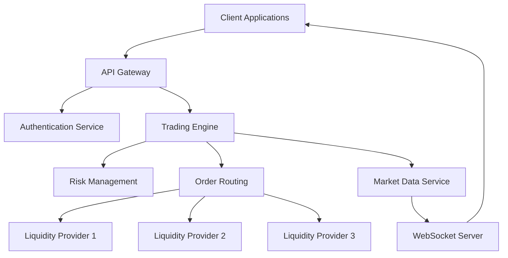

# Welcome to Trading Platform

Welcome to the comprehensive documentation for our professional trading platform. This guide will help you get started with trading, understand our platform features, and integrate with our powerful APIs.

## What is Trading Platform?

Trading Platform is a next-generation trading solution that provides:

- **Multi-Asset Trading**: Trade Forex, Cryptocurrencies, Commodities, Indices, and Stocks
- **Advanced Order Types**: Market, Limit, Stop, Stop-Limit, Trailing Stop, and more
- **Real-Time Market Data**: Low-latency price feeds with microsecond precision
- **Robust APIs**: REST, WebSocket, and FIX 4.4 protocols for algorithmic trading
- **Institutional-Grade Infrastructure**: 99.99% uptime with sub-millisecond execution
- **Comprehensive Risk Management**: Position limits, margin monitoring, and auto-liquidation
- **Multi-Platform Access**: Web, Desktop, Mobile, and API access

## Key Features

### Trading Features

- **One-Click Trading**: Execute trades instantly with a single click
- **Multiple Order Types**: Support for all standard and advanced order types
- **Hedging**: Open opposite positions on the same instrument
- **Partial Close**: Close portions of your position at different price levels
- **Algorithmic Trading**: Full API access for automated trading strategies

### Market Data

- **Real-Time Quotes**: Live bid/ask prices with market depth
- **Historical Data**: Access years of OHLC and tick data
- **Charts & Indicators**: TradingView integration with 100+ technical indicators
- **Market News**: Real-time economic calendar and news feed

### Risk Management

- **Stop Loss & Take Profit**: Automatic position management
- **Margin Monitoring**: Real-time margin level tracking
- **Risk Calculator**: Built-in tools to calculate position size and risk
- **Negative Balance Protection**: Your losses are limited to your deposit

### Technology

- **Low Latency**: Sub-millisecond order execution
- **High Availability**: 99.99% uptime guarantee
- **Security**: Bank-grade encryption and 2FA authentication
- **Scalability**: Handle thousands of orders per second

## Supported Instruments

### Forex (70+ Pairs)
- Major pairs: EUR/USD, GBP/USD, USD/JPY, etc.
- Minor pairs: EUR/GBP, GBP/JPY, AUD/NZD, etc.
- Exotic pairs: USD/TRY, EUR/PLN, USD/ZAR, etc.

### Cryptocurrencies (20+ Pairs)
- BTC/USD, ETH/USD, XRP/USD
- BNB/USD, SOL/USD, ADA/USD
- And more...

### Commodities
- Precious Metals: Gold, Silver, Platinum, Palladium
- Energy: Crude Oil, Brent Oil, Natural Gas
- Agricultural: Corn, Wheat, Soybeans, Sugar

### Indices
- US Indices: S&P 500, Nasdaq 100, Dow Jones
- European Indices: DAX, FTSE 100, CAC 40
- Asian Indices: Nikkei 225, Hang Seng

## Platform Architecture

## API Protocols

We support three different API protocols to suit your needs:

### REST API
- **Use Case**: Account management, historical data, reporting
- **Latency**: 10-50ms
- **Best For**: Web applications, mobile apps, dashboard

### WebSocket API
- **Use Case**: Real-time market data, order updates
- **Latency**: 1-5ms
- **Best For**: Real-time charts, live position monitoring

### FIX 4.4 Protocol
- **Use Case**: High-frequency trading, institutional trading
- **Latency**: Sub-millisecond
- **Best For**: Algorithmic trading, quantitative strategies

## Getting Help

### Documentation
- Browse our comprehensive guides
- Check out code examples
- Read API reference documentation

### Support
- **Email**: support@yourtradingplatform.com
- **Live Chat**: Available 24/7
- **Phone**: +1 (555) 123-4567
- **Discord**: Join our trading community

### Resources
- [Platform Status](https://status.yourtradingplatform.com)
- [API Status](https://status.yourtradingplatform.com/api)
- [Changelog](https://yourtradingplatform.com/changelog)
- [Blog](https://blog.yourtradingplatform.com)

## Next Steps

Ready to get started? Follow our [Quick Start Guide](./quick-start) to:

1. Create your account
2. Set up API credentials
3. Make your first trade
4. Explore advanced features

Let's begin your trading journey!

